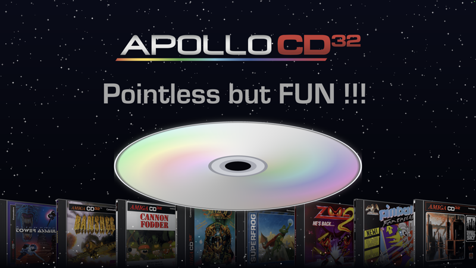

# #announcements — Week 40, 2026 (Sep 28 – Oct 04, 2026)

> **TL;DR** — Apollo Vampire Lair released WipEout Vamped (Oct 4) and DukeNukem3D Vamped, both ported for Apollo V4; ApolloBoot OMNI/TRIO R9.3 is still delayed pending extra tests on the latest Cores. ApolloExplorer was shared on Ko-fi.

## Top topics

### 📦 WipEout Vamped released for Apollo V4, with demo on Ko-fi
willemdrijver released WipEout Vamped, the classic PS1 game ported by Morten for Apollo V4, with a video and a playable demo on Ko-fi.

- Uses SAGA Maggie-3DFX and ARNE 16-bit audio.
- Teased with an intro image on Oct 3 before release on Oct 4.

🔗 [WipEout Vamped](https://youtu.be/H7MQ1PAMEDM) · 🔗 [WipEout-Vamped DEMO - Apollo Vampire Lair's Ko-fi Shop](https://ko-fi.com/s/1fe7a6b316)

_willemdrijver · [jump →](https://discord.com/channels/726870908568076380/745290452198096957/1556265634839400549)_

### 📦 DukeNukem3D Vamped released with video and Ko-fi download
willemdrijver shared the DukeNukem3D Vamped trailer video and Ko-fi page, plus a screenshot, on Oct 4.

🔗 [DukeNukem3D Vamped](https://youtu.be/44AHjTlHeO4) · 🔗 [DukeNukem3D-Vamped - Apollo Vampire Lair's Ko-fi Shop](https://ko-fi.com/s/51b78950e4)

_willemdrijver · [jump →](https://discord.com/channels/726870908568076380/745290452198096957/1556325726284808415)_

### ApolloBoot OMNI/TRIO R9.3 delayed for extra Core testing
willemdrijver said DukeNukem3D Vamped, WipEout Vamped and ApolloBoot OMNI/TRIO R9.3 were delayed a few days due to extra tests needed on the latest Cores.

- The two games have since been released.

❓ **Open:** ApolloBoot OMNI/TRIO R9.3 release date is not yet announced.

_willemdrijver · [jump →](https://discord.com/channels/726870908568076380/745290452198096957/1554512976751501325)_

## Also this week

- 📦 ApolloExplorer file transfer tool for Amiga shared on Ko-fi · 🔗 [ApolloExplorer - Apollo Vampire Lair's Ko-fi Shop](https://ko-fi.com/s/9062a0ffa8) · [jump →](https://discord.com/channels/726870908568076380/745290452198096957/1554456485654700105)

---
_Generated 2026-10-06 from 10 messages._
