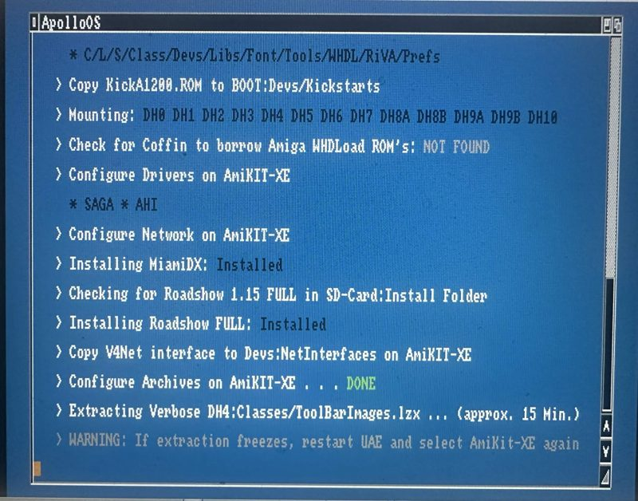
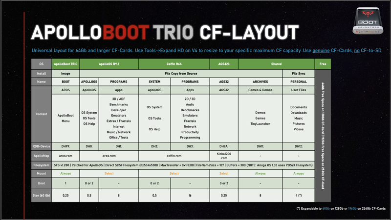

# #apolloboot — Week 40, 2026 (Sep 28 – Oct 04, 2026)

> **TL;DR** — ApolloBoot R93 is coming in a few days with AmiKit 12.8.3, fixing the AmiKit install hangs on OMNI R9.2. Larger-card setup and fixed partition layouts were explained, and an ApolloCD32 live demo was scheduled for Oct 6.

## Top topics

### AmiKit install hangs on ApolloBoot OMNI R9.2; R93 with AmiKit 12.8.3 coming
awakeningstar repeatedly hit hangs installing AmiKit XE on OMNI R9.2; willemdrijver said it is a known issue with AmiKit 11.5 and ApolloBoot R93 will ship AmiKit 12.8.3.

- tim3233 said space is not the issue; all OSs except EmuTOS (needs an SD) fit, and suggested lowering CPU speed in WinUAE due to extraction issues.
- awakeningstar's install hangs at extracting classes/Toolbarimages.lzx in FS-UAE; hansolo9190 suggested choosing AOS39 and testing another CF card.
- awakeningstar asked whether the installer writes a log file; no answer was given.

❓ **Open:** Cause of the hang at ToolBarImages.lzx remains unresolved.

_awakeningstar, willemdrijver, tim3233, hansolo9190 · [jump →](https://discord.com/channels/726870908568076380/836274852720541757/1555180931793297550)_

### Using 256GB cards and fixed partition layout with ApolloBoot
willemdrijver explained how to use a 256GB card with OMNI R9.2 and said ApolloBoot's partition layout and OS assignments are fixed so partitions can be mounted dynamically.

- Steps: back up PERSONAL (DH12:), run ApolloMax, resize DH12: with HD-Toolbox, reboot, format as Personal, restore.
- Custom partitions and menu entries in the TRIO setup are not possible.
- mikohelsing asked about using a 256GB SD with ApolloBoot ZERO; no answer given.

_arcam10, willemdrijver, mikohelsing · [jump →](https://discord.com/channels/726870908568076380/836274852720541757/1555234501745971244)_

### ApolloCD32 live demo set for Oct 6; new version with 1.3 setup expected next weekend
willemdrijver scheduled an ApolloCD32 live demo for Tuesday Oct 6 at 7:00 PM CET in the videoroom, and estimated the new version with the 1.3 setup next weekend.

- Discord shows the stream time in each reader's local timezone.

_willemdrijver, kiasanth, tjomp · [jump →](https://discord.com/channels/726870908568076380/836274852720541757/1556341676690251799)_

## Also this week

- clayntexas: Preload flash only boots Apollo; later WB39 fixed uSD, asks about IDE2SD · [jump →](https://discord.com/channels/726870908568076380/836274852720541757/1555407861989773385)

---
_Generated 2026-10-06 from 49 messages._
