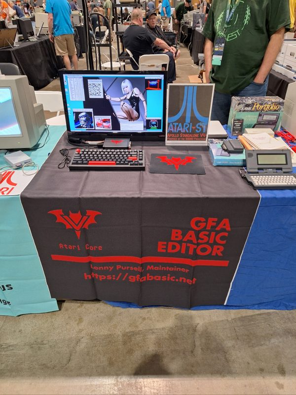

# #atari — Week 40, 2026 (Sep 28 – Oct 04, 2026)

> **TL;DR** — lonnypursell shared a photo of their VCF-Midwest 21 table, which drew strong reactions. In follow-up, they pointed slaapliedje to Turbo BASIC XL (already ported, sources available) or STOS as options for BASIC on gem4xe.

## Top topics

### lonnypursell shows VCF-Midwest 21 table setup with a small keyboard on the V4
lonnypursell posted a photo of their VCF-Midwest 21 table; in replies they explained the tiny keyboard, bought as a NUC programmer for the core, was kept on the V4 after working there.

- The keyboard is backlit red and was probably unplugged in the photo to stop people resetting the machine.
- The three-square pattern tommo8871 asked about is a QR code.
- lonnypursell had issues at previous years' shows when walking away, but none this year.

_lonnypursell, tommo8871, kamelito · [jump →](https://discord.com/channels/726870908568076380/858224790808821760/1555197013090500670)_

### Options for BASIC on gem4xe: Turbo BASIC XL already ported, STOS sources available
slaapliedje wanted to port GFA BASIC to gem4xe; lonnypursell said Turbo BASIC XL, by the same author, is already ported and its sources are available, and suggested STOS as another fit.

- Turbo BASIC XL sources are on AtariWiki, so new features could be added.

🔗 [AtariWiki V3.1: Turbo-BASIC XL](https://atariwiki.org/wiki/Wiki.jsp?page=Turbo-BASIC%20XL#section-Turbo-BASIC+XL-SourceCode)

_slaapliedje, lonnypursell · [jump →](https://discord.com/channels/726870908568076380/858224790808821760/1555275103598551101)_

---
_Generated 2026-10-06 from 15 messages._
