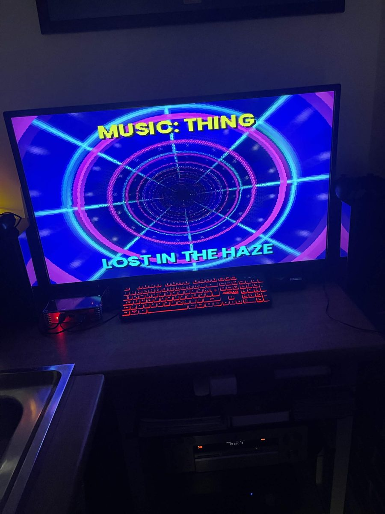
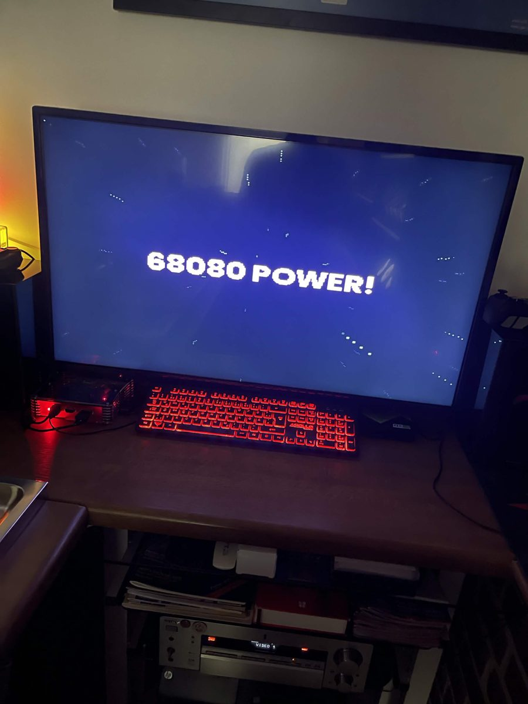

# #democoding — Week 39, 2026 (Sep 21 – Sep 27, 2026)

## Top topics

### 📦 tommysammy releases first Claude-assisted demo, HazeDemo_V4
tommysammy posted a demo made with help from Claude, shared as HazeDemo_V4.zip with three screenshots.

- Runs on V4 only
- Runs in a loop; a mouse button quits it
- Runs only from RAM

📎 [`HazeDemo_V4.zip` (2.3 MB)](https://discord.com/channels/726870908568076380/1091013242089918544/1553789998619168768)

  

_tommysammy · [jump to thread →](https://discord.com/channels/726870908568076380/1091013242089918544/1553789712609845472)_

---
_Generated 2026-10-06 from 2 messages._
