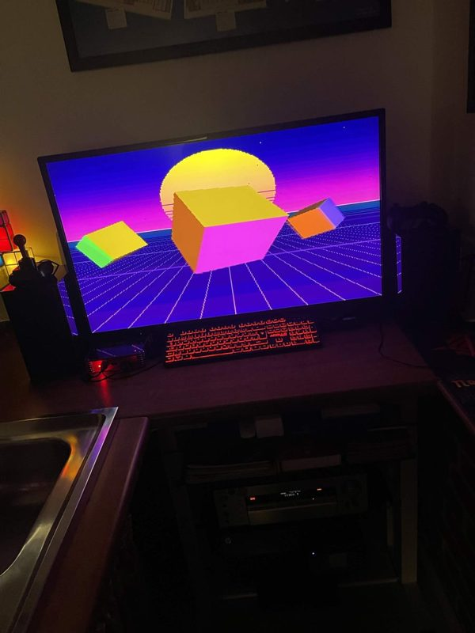

# #democoding — Week 39, 2026 (Sep 21 – Sep 27, 2026)

> **TL;DR** — tommysammy released HazeDemo_V4, their first demo made with help from Claude. It is V4-only, loops until a mouse button is pressed, and runs only from RAM.

## Top topics

### 📦 tommysammy releases HazeDemo_V4, first demo made with Claude's help
tommysammy shared HazeDemo_V4, their first demo made with help from Claude, with screenshots and a zip download.

- Runs on V4 only
- Runs in a loop; a mouse button quits it
- Runs only from RAM

📎 [`HazeDemo_V4.zip` (2.3 MB)](https://discord.com/channels/726870908568076380/1091013242089918544/1553789998619168768)

_tommysammy · [jump →](https://discord.com/channels/726870908568076380/1091013242089918544/1553789712609845472)_

---
_Generated 2026-10-06 from 2 messages._
