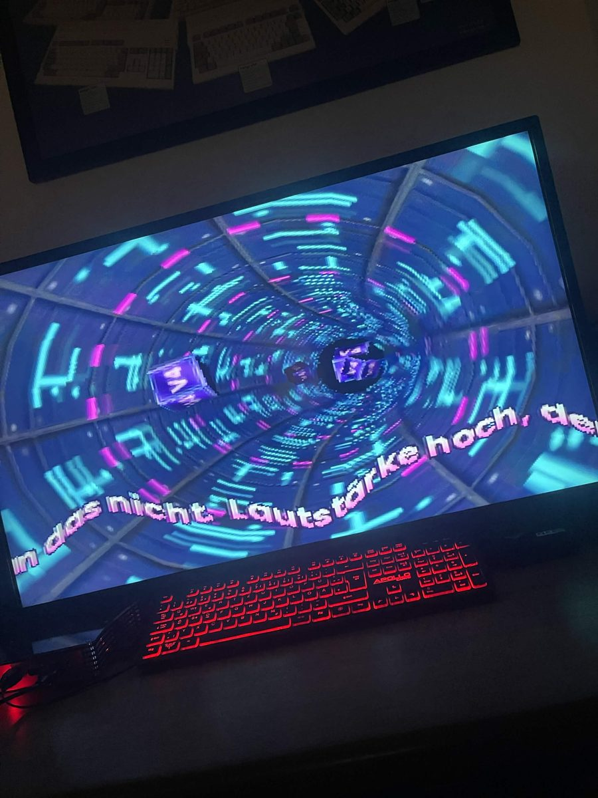
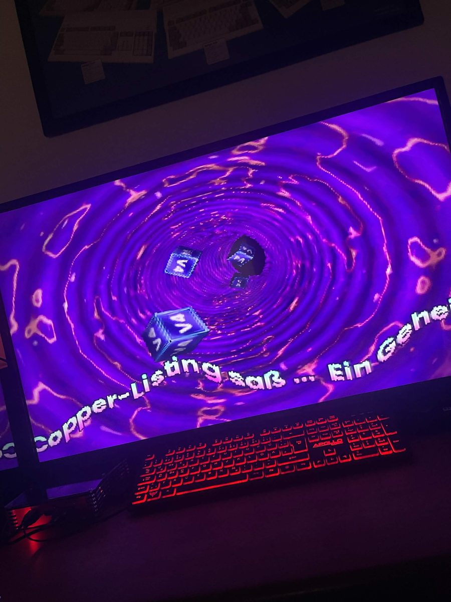
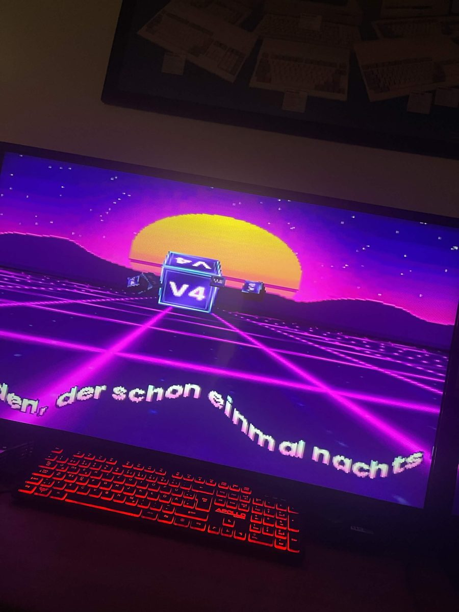
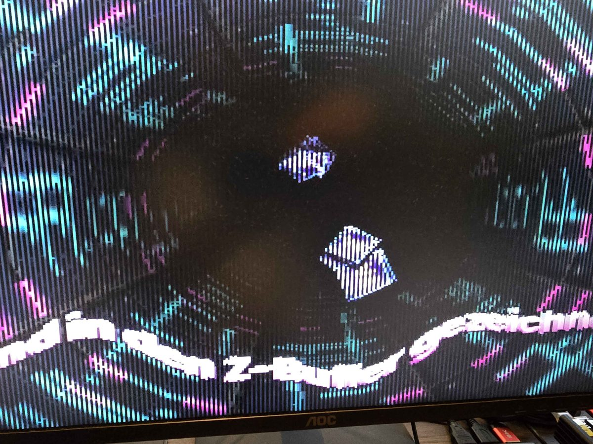

# #democoding — Week 40, 2026 (Sep 28 – Oct 04, 2026)

> **TL;DR** — tommysammy posted a "Final Version" of the V4-only HazeDemo and then released Maggie Haze, a Maggie-based demo with source included. tjomp reported graphics errors on a V4SA, possibly tied to an outdated Maggie.library.

## Top topics

### 📦 Maggie Haze released with source; tjomp sees graphics errors on V4SA
tommysammy released Maggie Haze, a demo using Maggie, and the thread covered its low resolution, the shared source, and graphics errors tjomp saw on a V4SA that may relate to the installed Maggie.library version.

- hansolo9190 found the resolution very low and suggested doubling it; tommysammy said the first version was 640x480 but too slow for 3-D tunnels.
- hansolo9190 suggested Gunnar could help fine-tune it; tommysammy said the source code is in the package.
- tjomp praised the clean coding style and noted that on V4 any memory can be used for audio and graphics, while the demo allocates Chipmem for audio.
- tjomp got graphics errors running it on a V4SA; tommysammy asked whether the latest Maggie.library was installed.
- tjomp uses the Maggie.library that came with their ApolloOS install, and it reports version 1.30; hansolo9190 has 3.3 and called 1.30 very old.
- tommysammy took the library version from the latest Saga package and did not know the latest version number; hansolo9190 asked them to run `version libs:maggie.library`, and tommysammy said they would do it later.

❓ **Open:** Which Maggie.library version is current and whether it fixes tjomp's graphics errors is not settled; tommysammy has yet to run `version libs:maggie.library`.

📎 [`Magie_Haze.zip` (8.3 MB)](https://discord.com/channels/726870908568076380/1091013242089918544/1554157519528661073)

   

_tommysammy, tjomp, hansolo9190 · [jump to thread →](https://discord.com/channels/726870908568076380/1091013242089918544/1554157422442975352)_

### 📦 HazeDemo V4 "Final Version" v2.3 posted
tommysammy posted HazeDemo_V4_v2.3.zip as the final version of the V4-only HazeDemo.

📎 [`HazeDemo_V4_v2.3.zip` (4.6 MB)](https://discord.com/channels/726870908568076380/1091013242089918544/1554133811464245370)

_tommysammy · [jump to thread →](https://discord.com/channels/726870908568076380/1091013242089918544/1554133811464245370)_

### Spy Girl by Oranges shared from Deadline 2026
hansolo9190 shared the Pouet page for Spy Girl by Oranges, an intro in the Wild compo at Deadline (Berlin) 2026, which drew many positive reactions.

_hansolo9190 · [jump to thread →](https://discord.com/channels/726870908568076380/1091013242089918544/1556210351320858704)_

## Links

**Projects & releases**
- [Spy Girl by Oranges](https://www.pouet.net/prod.php?which=107070) — Pouet page for an intro entered in the Wild compo at Deadline (Berlin) 2026, shared without comment. _(hansolo9190)_

---
_Generated 2026-10-06 from 27 messages._
