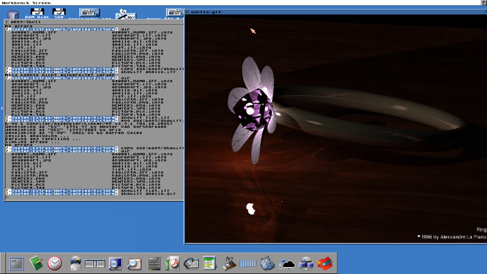

# #developers — Week 40, 2026 (Sep 28 – Oct 04, 2026)

> **TL;DR** — eriktier's self-hosted opForge assembled itself on an A6000 in 15 seconds versus 15 minutes under FS-UAE. A long debate on AI-assisted coding for Amiga took place, and kimsnarf reported bitplane-pointer scrolling stutter on V4 that vanished when redrawing the screen under SAGA.

## Top topics

### opForge self-hosts on A6000 in 15 seconds, versus 15 minutes in FS-UAE
eriktier's re-coded opForge, using a binary memory representation, assembled itself from 61 files (719329 bytes of 68020 source) on an A6000 in 15 seconds; FS-UAE took 15 minutes.

- Fully instrumented run took 58 seconds: 49.16 s preparation, 8.82 s assembly; tokenization was the largest phase at 22.99 s.
- Planned: incremental builds via file timestamps, modules as .o files or .library, and selectively embedded VM bytecode packages.
- Not yet feature-complete; full parity with the current Rust version comes first.

❓ **Open:** Phase-only instrumentation is still needed for a less intrusive timing breakdown.

_eriktier · [jump →](https://discord.com/channels/726870908568076380/730698753513750539/1555151889601929288)_

### Debate on AI-assisted programming for Amiga: quality versus accessibility
After olafsch. shared AI-generated ShowIFF viewers, a long discussion followed on whether AI helps non-programmers and the platform, or lowers software quality; no consensus was reached.

- olafsch. generated an assembler ShowIFF and an Amiga-E datatypes viewer with Claude, and adapted it to AROS.
- kimsnarf argued non-trivial programs still need engineering knowledge, and feared quality loss and clashing AI and non-AI workflows.
- niding and rogue_particle described using LLMs for workbooks and Fred80 snippets, stressing verification of the output.

📎 [`showiff.s` (19 KB)](https://discord.com/channels/726870908568076380/730698753513750539/1555558779997650975) · 📎 [`ShowIFF.e` (4 KB)](https://discord.com/channels/726870908568076380/730698753513750539/1555574184984453195) · 📎 [`ShowIFF.e` (3 KB)](https://discord.com/channels/726870908568076380/730698753513750539/1555569526504947774) · 📎 [`showiff` (3 KB)](https://discord.com/channels/726870908568076380/730698753513750539/1555574184984453195) · 📎 [`Screen_Recording_2026-10-03_at_5.57.07_pm.mov` (41.3 MB)](https://discord.com/channels/726870908568076380/730698753513750539/1555851755085111336) · 🔗 [Fred80](https://fred80.dev/) · 🔗 [Fred80 OddJobEddie game preview](https://www.youtube.com/watch?v=fDJx9zAdF1k)

_olafsch., kimsnarf, rogue_particle, niding · [jump →](https://discord.com/channels/726870908568076380/730698753513750539/1555558779997650975)_

### Bitplane-pointer scrolling stutters on V4; redrawing the screen under SAGA is smooth
kimsnarf saw microstutter with OCS-style bitplane-pointer scrolling on a V4 standalone, even without drawing; redrawing each frame in SAGA was smooth, so kimsnarf continues with SAGA.

❓ **Open:** The cause of the OCS-mode stutter is unknown; kimsnarf may revisit it later.

🔗 [MENACE.S source](https://github.com/davepoo/Menace-Amiga-Format/blob/main/Source/MENACE.S) · 🔗 [The whole truth about Games Programming Part 2: Scrolling](https://codetapper.com/amiga/diary-of-a-game/menace/part-2-scrolling/)

_kimsnarf, brigwald, biggun68080 · [jump →](https://discord.com/channels/726870908568076380/730698753513750539/1554024817068343337)_

## Also this week

- rogue_particle's zoom-effect carts reach 60fps on V4 · [jump →](https://discord.com/channels/726870908568076380/730698753513750539/1555114565925343254)
- rogue_particle asks about a Halloween game jam · [jump →](https://discord.com/channels/726870908568076380/730698753513750539/1555866194563698772)

## Links

**Code & tools**
- [alb42/Leu](https://github.com/alb42/Leu) — Simple Amiga spreadsheet app, suggested to niding who wanted a spreadsheet. _(hansolo9190)_

**Projects & releases**
- [Ignition](https://ignition-amiga.sourceforge.net/) — Spreadsheet recommended as working on AROS. _(olafsch.)_

**Articles & videos**
- [Amiga Assembly Library](https://amiga-assembly-library.vercel.app/) — Documentation for the Amiga Assembly Library v41.21, in reply to a question. _(kamelito)_
- [The Sorcerer's Apprentice [HD] (VHS Version)](https://vimeo.com/75359534) — Humorous video contributed to the AI discussion. _(r3dbug)_

---
_Generated 2026-10-06 from 228 messages._
