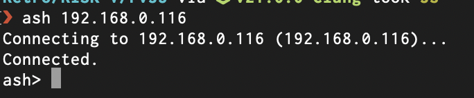

# #english — Week 40, 2026 (Sep 28 – Oct 04, 2026)

> **TL;DR** — ApolloExplorer gained the new ASH remote shell; users discussed wanting a minimal ApolloOS and a package manager (Willemdrijver: "Soon"). A6000 vs V4SA advice, WipEout Vamped demo and a joypad D-mode fix also featured.

## Top topics

### ApolloOS wishlist: minimal install, package manager, bigger partitions
Users asked for a minimal ApolloOS, a package manager and updates without CF reflash; willemdrijver said wishes are heard and a package manager is coming "Soon".

- V4 internal CF card is painful to reflash, so in-OS updates were requested
- asktodd reports partitions on images are ~94% full and wants larger ones
- zyber.se pointed to amipkg as an existing package manager attempt

🔗 [GitHub - thomas-luebker/amipkg](https://github.com/thomas-luebker/amipkg)

_kimsnarf, willemdrijver, reaperx2637, asktodd · [jump →](https://discord.com/channels/726870908568076380/827071192195268608/1555814767447253183)_

### ApolloExplorer adds ASH remote shell; eriktier debugs macOS setup
The new ApolloExplorer has ASH remote shell; eriktier fixed a missing Qt Homebrew install on macOS, and ASH worked on ApolloOS but hung on AmigaOS 3.2.3.

- ACP existed in the previous version; ASH is new
- Amiga-to-Amiga connection is not supported; willemdrijver called skizzolfscrew's request interesting

_eriktier, willemdrijver, skizzolfscrew · [jump →](https://discord.com/channels/726870908568076380/827071192195268608/1554475842057535489)_

### A6000 vs V4+ Standalone: owners advise buying the A6000
Willemdrijver answered a buyer's questions: same FPGA, WiFi works on A6000, core versions are back in sync; most owners recommended the A6000, tjomp prefers the V4SA.

- A6000 RAM is slightly faster and it is always certified for the x14 core
- A6000 is a V4, so the WiFi module works

_ndjordjevic5067, willemdrijver, tjomp, kimsnarf · [jump →](https://discord.com/channels/726870908568076380/827071192195268608/1556195730962784357)_

## Also this week

- WipEout Vamped demo released; joypad issue solved with D mode · 📎 [`IMG_2654.mov` (5.5 MB)](https://discord.com/channels/726870908568076380/827071192195268608/1556328988736225453) · 🔗 [WipEout Vamped](https://youtu.be/H7MQ1PAMEDM) · 🔗 [WipEout-Vamped DEMO - Apollo Vampire Lair's Ko-fi Shop](https://ko-fi.com/s/1fe7a6b316) · 🔗 [DukeNukem3D Vamped](https://youtu.be/44AHjTlHeO4) · [jump →](https://discord.com/channels/726870908568076380/827071192195268608/1556267913315622942)
- AROS kernel reportedly boots AmigaOS4 on X5000 · 🔗 [AROS Kernel powers AmigaOS4](https://x.com/amigang/status/2104887961871417825?s=46)
- squirtleuk seeks price advice for selling V4SA

## Links

**Code & tools**
- [amigazen - Overview](https://github.com/amigazen/) — amigazen repos (AWeb, AmigaPython, Voyager); testers wanted before Aminet release. _(amigazen)_

---
_Generated 2026-10-06 from 111 messages._
