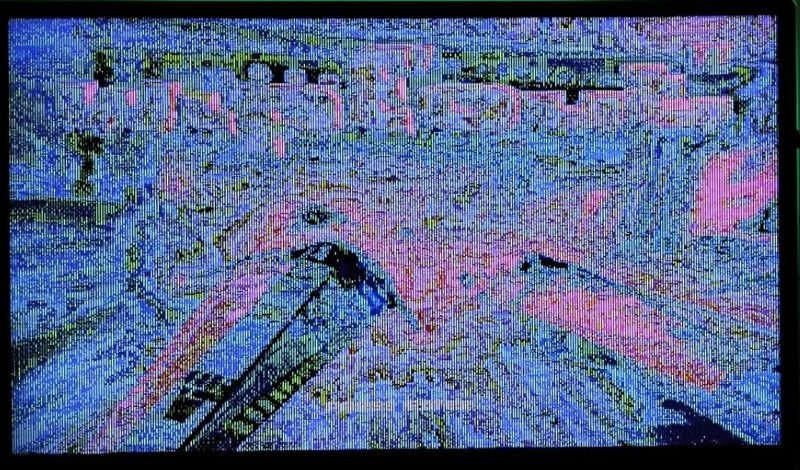

# #games — Week 40, 2026 (Sep 28 – Oct 04, 2026)

> **TL;DR** — WipEout Vamped demo by Morten released for Apollo V4 (free demo, feedback on glitches and keyboard); Duke Nukem 3D Vamped also shown. tommysammy is porting Hurrican to V4, rogue_particle shared fred80 games and AI music, and JetPilot crashes on Vampire.

## Top topics

### 📦 WipEout Vamped playable demo released for Apollo V4; testers report glitches
willemdrijver shared WipEout Vamped, Morten's port using SAGA Maggie-3DFX, with a free demo; danyppc tested it and reported keyboard and graphics issues, while biggun68080 confirmed it works with joypad.

- Core 12205 renders correctly; core 12256 corrupts graphics; the 12556D core from the website works fine per danyppc.
- Keyboard doesn't respond in menu or game; biggun68080 says the PS1 original supported only joypad.
- danyppc also reported shield-pickup screen glitches and wrong shot effects; willemdrijver promised an update at some point.

❓ **Open:** Whether Morten will add keyboard control and fix the glitches in an update.

📎 [`WipEout-Vamped-Demo-Download.mp4` (38.4 MB)](https://discord.com/channels/726870908568076380/969942713560621157/1556321161674236146) · 🔗 [WipEout Vamped](https://youtu.be/H7MQ1PAMEDM) · 🔗 [WipEout-Vamped DEMO - Apollo Vampire Lair's Ko-fi Shop](https://ko-fi.com/s/1fe7a6b316) · 🔗 [UNICORN_12556D core](http://www.apollo-core.com/releases/UNICORN_12556D_x14_18.jic) · 🔗 [DukeNukem3D Vamped](https://youtu.be/44AHjTlHeO4)

_danyppc, willemdrijver, biggun68080, tommysammy · [jump →](https://discord.com/channels/726870908568076380/969942713560621157/1556266014524710982)_

### tommysammy ports Hurrican to Vampire 4 using Claude
tommysammy is porting the free-source Hurrican (2007 PC game) to V4 only, showing WIP videos, and said Claude helps with coding and debugging; English text is on the todo list.

- Hurrican is distinct from Turrican; source code is free on GitHub.
- danyppc described an AI-made Sonic targeting 060 that runs at 50fps on A1200PPC/060.

📎 [`IMG_0651.mov` (5.5 MB)](https://discord.com/channels/726870908568076380/969942713560621157/1555077848119906334) · 📎 [`glidesmall.mov` (26.9 MB)](https://discord.com/channels/726870908568076380/969942713560621157/1555147247006650398) · 🔗 [Hurrican 68k Vampire 4 WIP](https://youtu.be/iea9Pz4a3Ec?is=KKC-gQAxtr1KaERq) · 🔗 [HurricanGame/Hurrican](https://github.com/HurricanGame/Hurrican)

_tommysammy, danyppc, kamelito, rogue_particle · [jump →](https://discord.com/channels/726870908568076380/969942713560621157/1555077848119906334)_

### JetPilot crashes on Vampire entering flight; moved to compatibility channel
sonicxm479 can't get JetPilot past the menus on Vampire, with it working on MiSTer and Pimiga; biggun68080 asked for setup details and the report was redirected to the compatibility channel.

❓ **Open:** sonicxm479 still owes answers on OS, kickstart, core, debugger output and install method.

📎 [`JetPilot-WHDL.lha` (1.9 MB)](https://discord.com/channels/726870908568076380/969942713560621157/1554118872993636354)

_sonicxm479, biggun68080, danyppc, asktodd · [jump →](https://discord.com/channels/726870908568076380/969942713560621157/1554090196524605452)_

## Also this week

- 📦 rogue_particle shares fred80 games, Halloween jam idea and offline AI music model · 📎 [`thrust_small.mov` (24.9 MB)](https://discord.com/channels/726870908568076380/969942713560621157/1554755234704793700) · 📎 [`chord_demo_follow.wav` (1.5 MB)](https://discord.com/channels/726870908568076380/969942713560621157/1556191426360901662) · 📎 [`IMG_3874-compressed.mov` (3.6 MB)](https://discord.com/channels/726870908568076380/969942713560621157/1556107365504516239) · 🔗 [Thrust the Fred-80 Edition and Spectrum Next](https://country-bumpkin-software.itch.io/thrust-the-fred-80-edition) · [jump →](https://discord.com/channels/726870908568076380/969942713560621157/1556280224398970940)
- Build-engine games and newer ports on Vampire discussed · [jump →](https://discord.com/channels/726870908568076380/969942713560621157/1556356234049880187)
- 📦 Without Frontier 0.2.0 BETA space sim shared · 🔗 [Without Frontier 0.2.0 BETA demo](https://www.youtube.com/watch?v=2jVNZG29P8s) · 🔗 [Amiga Portal post](https://www.amigaportal.cz/node/180554?p=181465#post181465) · 🔗 [WithoutFrontierAGA-WHDL.lha](https://www.amigafrance.com/download/Aladin/WHDLG/68k+/WithoutFrontierAGA-WHDL.lha) · [jump →](https://discord.com/channels/726870908568076380/969942713560621157/1556401854345257051)

## Links

**Projects & releases**
- [AirTiger Strike AGA by Fliegeralarm Games](https://fliegeralarm-games.itch.io/airtiger-strike) — AGA Apache shoot 'em up danyppc wants to buy. _(danyppc)_

**Articles & videos**
- [Build (game engine)](https://en.wikipedia.org/wiki/Build_(game_engine)) — Background on the Build engine. _(aftonstjaerna)_

**Other**
- [LukHash](https://www.youtube.com/channel/UCPOeoWonGJfK6wM3S8hZ0Tw) — Suggested chiptune artist as AI training source. _(niding)_
- [HVSC](https://www.hvsc.c64.org/) — SID library suggested as training source. _(niding)_

---
_Generated 2026-10-06 from 253 messages._
