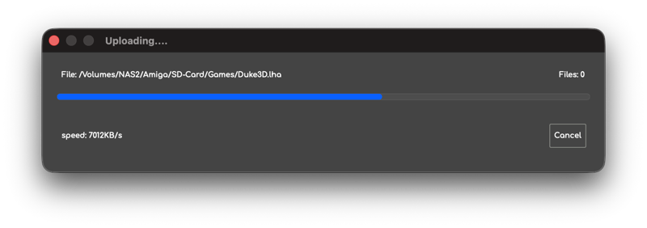

# #v4-series-the-best — Week 40, 2026 (Sep 28 – Oct 04, 2026)

> **TL;DR** — Newcomers got Vampire/Apollo setup advice, a CoffinOS local-IDE boot problem was reported, Apollo Explorer network speed was discussed, and Nah-Kolor's NRG 2026 invitation demo was shared.

## Top topics

### 📦 Running - NRG 2026 Invitation demo by Nah-Kolor supports 080 Vampire
magicnah shared the Amiga AGA invitation demo for Deadline 2026; it runs on 080 Vampire cards with Apollo core 12207 or newer, and hansolo9190 praised it.

- Requires Apollo core 12207 at minimum

🔗 [Running - NRG 2026 Invitation by Nah-Kolor](https://www.pouet.net/prod.php?which=107076)

_magicnah, hansolo9190 · [jump →](https://discord.com/channels/726870908568076380/726871100243312650/1556249209475170345)_

### CoffinOS does not boot from A600 local IDE, only V4 built-in IDE
fpmpaolo asked how to boot a Coffin CF card from the A600's local IDE; willemdrijver expected it to work, but fpmpaolo reported it boots only from the V4 built-in IDE.

- fpmpaolo runs Maticore core 11350

❓ **Open:** No fix for booting CoffinOS from local IDE was given.

_fpmpaolo, willemdrijver · [jump →](https://discord.com/channels/726870908568076380/726871100243312650/1554956221465890877)_

### Apollo Explorer network speed limits; newer cores in the works
skizzolfscrew asked about faster networking on Apollo Explorer; willemdrijver said newer cores with better network speed are in development, and djbase suggested using FTP.

- skizzolfscrew reports large transfers sometimes freeze

_skizzolfscrew, willemdrijver, djbase · [jump →](https://discord.com/channels/726870908568076380/726871100243312650/1556284684974161920)_

## Also this week

- Newcomer jeffadams2024 sets up V4SA with Apollo; advice on Amiga OS quirks · [jump →](https://discord.com/channels/726870908568076380/726871100243312650/1553920108785832019)
- Assembling rendered LightWave frames into animations on V4 · [jump →](https://discord.com/channels/726870908568076380/726871100243312650/1556064873958477884)
- Floppy drive on A6000 likely needs a classic Amiga host · [jump →](https://discord.com/channels/726870908568076380/726871100243312650/1555880478945443841)
- clayntexas gets uSD working after WB39, asks about IDE2SD setup · [jump →](https://discord.com/channels/726870908568076380/726871100243312650/1556312154913636383)

---
_Generated 2026-10-06 from 39 messages._
